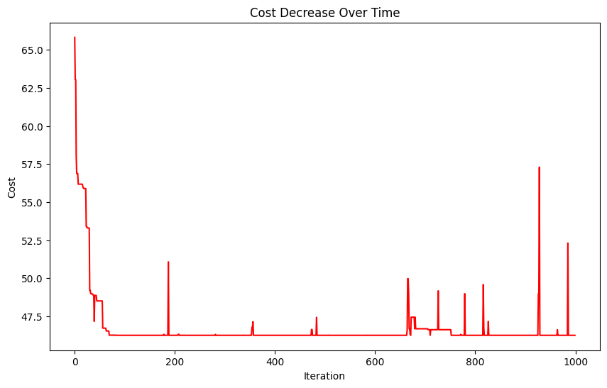
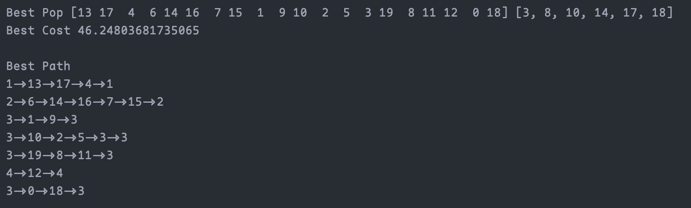
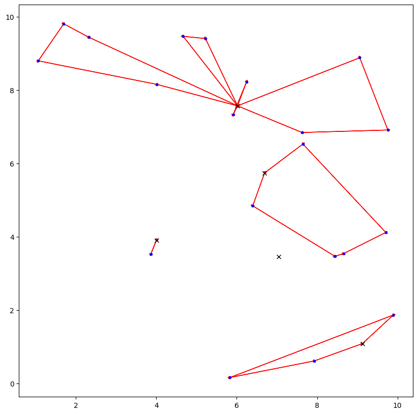

# 高级算法大作业

>
> 利用遗传算法解决多起点多终点多旅行商问题(*MDTSP*) 

## 原问题的分析

原问题叫无人机配送路径问题，可以大致抽象为TSP问题。与传统的TSP问题不同，原问题是多起点、多旅行商。需要同时考虑路径的划分和路径的起点。这种问题在学术上被叫作multi-depot travelling salesman problem。

下面对这个问题进行抽象：

所有的配送中心被视为旅行商问题起点，所有的订单中的卸货点被视为目的地，无人机被视为旅行商。优化目标为多无人机到达所有的目的地，所有无人机的路径最短，并且订单满足时间条件，无人机满足最大路径条件。

为了简单起见，对于订单的推迟配送情况不做考虑，对无人机的携带数量不做考虑。

## 地图生成

地图的生成直接采用随机数在10x10的地图范围内随机生成点的位置。

具体而言在实际程序中，起点共5个，目的地共20个。

起点到目的地、目的地与目的地之间的具体可用坐标计算得到

## 遗传算法

遗传算法的关键思路借鉴于Elad Kivelevitch在2011年所写的MDMTSPV_GA Matlab算法

### 遗传个体

为了满足多起点的条件，这里的遗传个体由两个部分组成。

一是所有目的地的排列，二是这个排列的切割点。

举例：

```python
population: [[15 19  0  9  3  6  8 10 18 11 12 17  2  7  5  4 16 14  1 13] [0, 0, 9, 10, 15, 15]]

# 其对应的目的地路径
# 注意切割中存在无效切割点，因此最终只有4条路径
[15->19->0->9->3->6->8->10->18]
[11]
[12->17->2->7->5]
[4->16->14->1->13]
```

请注意，这里切割出来的路径仅仅是目的点的路径，与起点无关

### 代价

这里使用最简单的代价：所有无人机路程的总和，从种群中取代价最小的个体作为下一代的种群。

为了满足订单的时间条件，会在计算个体代价时对订单的时间进行检测，如果出现超时就适当增加该个体的代价。(未实现，交给下一位了)

#### 代价的计算

在本算法的个体的设置情况下，该个体的代价可由两部分组成：起点与目的地之间，目的地与目的地之间。

其中，当遗传个体确定的情况下，其目的地与目的地之间的代价也确定。而起点与目的地之间的距离会随着起点的变化而变化。

这里采用一种暴力的方法来计算起点与目的地之间的代价，即遍历所有的起点，依次计算在起点到每个目的地路径的距离，从中找到每条路径所对应的最佳起点，即找到了一个遗传个体所对应的最佳起点集合。

```python
for i in range(self._population_size):
  route = self._population_route[i]
  breaks = self._population_break[i]
  t2t_cost = self.get_range_cost(route, breaks)
  d2t_cost = self.get_best_break_cost(route, breaks)
  distance = d2t_cost + t2t_cost
  self.total_distance[i] = distance
```

### 选优

本算法的变异和交叉操作均对部分优秀个体进行。具体而言，会从所有的种群中选取代价最小的8个个体，进行进一步的交叉和变异操作（有概率）。

### 交叉

本算法的交叉操作仅对遗传个体中的所有目的地的排列进行，对分割点操作无实际意义。对所有目的地的排列的交叉操作与单起点的TSP问题类似。

交叉操作分为两种，pmx交叉和ox交叉，会根据概率从两种交叉方式中随机选取一种进行。

pmx交叉即部分匹配交叉，会随机选取基因片段进行交叉，建立每个染色体的匹配关系，并根据匹配问题解决交叉所带来的冲突。

ox交叉即顺序交叉，在两个父代染色体中随机选择起始和结束位置，将父代染色体1该区域内的基因复制到子代1相同位置上，再在父代染色体2上将子代1中缺少的基因按照顺序填入。不需要做冲突检测。

利用交叉操作，将8个个体重新扩充到种群的数目，随后才对种群进行变异。

### 变异

本算法的变异操作分为两种，一种是对目的地排列进行变异，一种是对分割点进行变异。

目的地排列的个体变异的方法有三种：swap, insert, reverse

swap 即对个体的两个基因点进行互换

insert 即将个体的一个基因点随机插入到一个位置

reverse 即将个体的一个基因片段进行翻转操作

### 非法检测

在所有的个体中，可能会存在非法的个体（个体中某个无人机的路程超过了无人机的最大路程20km），这种个体需要在遗传时进行额外考虑。

本算法采取的方式是，在每次对种群进行选优之前，先对所有的个体进行检测，当遇到非法个体时，重新随机生成新的个体来替代原来的非法个体（必须要求生成的个体合法），这种方法会显著降低算法运行的速度，但是会给种群带来更多的随机性。

## 代码实现

利用Python对本遗传算法进行实现，遗传的轮数设置在1E3(1000)轮。

在算法运行刚开始时，种群中存在大量非法个体，重新生成个体所花时间较长。

```
Epochnum	Cost						Time
Epoch 0	80.39232430889766	5.84
Epoch 1	79.50911572285412	3.52
Epoch 2	71.7132768198305	4.66
Epoch 3	75.99743455502171	0.04
Epoch 4	75.99743455502171	4.7
Epoch 5	73.6935662664601	0.97
Epoch 6	74.14153559463611	3.28
Epoch 7	72.87642101338108	4.16
Epoch 8	74.79710684025443	2.76
Epoch 9	73.84450532458447	3.19
```

而在种群趋于稳定时，其非法个体数量少，生成所需时间也相对降低

```
Epoch 990	46.52622495493601	0.14
Epoch 991	46.52622495493601	0.02
Epoch 992	46.52622495493601	0.76
Epoch 993	46.52622495493601	0.02
Epoch 994	46.52622495493601	3.31
Epoch 995	49.07685338487766	0.02
Epoch 996	46.52622495493601	4.23
Epoch 997	46.52622495493601	1.11
Epoch 998	46.52622495493601	0.02
Epoch 999	46.52622495493601	1.05
```

下面是，每次迭代过程中的最优个体的代价随着迭代次数下降的折线图。



可以看出，最优代价在接近250次迭代的时候已经接近最低的稳定值了。

下面是针对具体实例的具体解的演示。



反映在图中为



